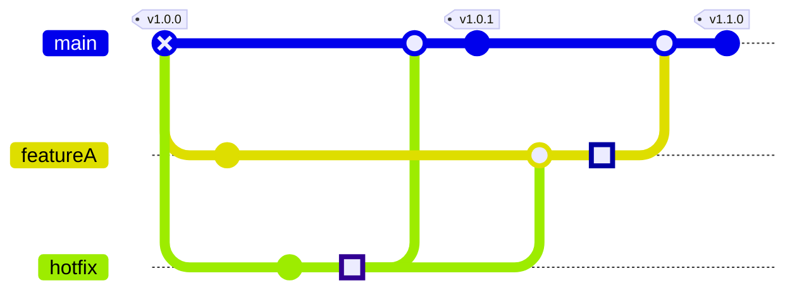

+++
title = "画面確認用デバッグ・ページ"
date =  "2020-08-11T10:05:48+09:00"
description = "description"
image = "/images/attention/site.jpg"
tags = ["site", "web"]
pageType = "text"
draft = true

[scripts]
  mathjax = true
  mermaidjs = true
+++

## 見出し2
### 見出し3
#### 見出し4
##### 見出し5
###### 見出し6

## 各部品の表示

通常の \<p\>aragraph[^tn1].

[^tn1]: 脚注。

閑話休題

*強調1* **強調2** `Code表示012` ~~打ち消し~~


!!! caution !!!


1. 番号付きリスト1
    - リンク : [WEB色見本 原色大辞典 - HTMLカラーコード](https://www.colordic.org/)
    - PDF : 
2. 番号付きリスト2


- &#x845B; (U+845B)
- &#x845B;&#xE0100; (U+845B U+E0100)
{ .cloud .center .huge }


### 定義リスト

定義1
: 内容1

定義2
: 内容2 

### フェンス付きコード・ブロック

```go {hl_lines=[3]}
package main

import "fmt"

func main() {
    fmt.Println("Hello World!")
    //Output: Hello World!
}
```

### 引用


{}著作者は、その著作物の原作品に、又はその著作物の公衆への提供若しくは提示に際し、その実名若しくは変名を著作者名として表示し、又は著作者名を表示しないこととする権利を有する。その著作物を原著作物とする二次的著作物の公衆への提供又は提示に際しての原著作物の著作者名の表示についても、同様とする{}。




### 図表







{} <!-- プログラミング言語Go -->

### 数式（MathJax）

エネルギーと質量には $E=mc^2$ の関係がある。

エネルギーと質量には $$E=mc^2$$ の関係がある。

\[
C_p[\ce{H2O(l)}] = \pu{75.3 J // mol K}
\]

`<figure>` 要素で囲ってみる。


\begin{aligned}
KL(\hat{y} || y) &= \sum_{c=1}^{M}\hat{y}_c \log{\frac{\hat{y}_c}{y_c}} \\
JS(\hat{y} || y) &= \frac{1}{2}(KL(y||\frac{y+\hat{y}}{2}) + KL(\hat{y}||\frac{y+\hat{y}}{2}))
\end{aligned}


さらに四角で囲ってみる。


\begin{aligned}
KL(\hat{y} || y) &= \sum_{c=1}^{M}\hat{y}_c \log{\frac{\hat{y}_c}{y_c}} \\
JS(\hat{y} || y) &= \frac{1}{2}(KL(y||\frac{y+\hat{y}}{2}) + KL(\hat{y}||\frac{y+\hat{y}}{2}))
\end{aligned}


### シーケンス図（Mermaid）


sequenceDiagram
    カバ->>+カバン: あなた，泳げまして？
    カバン-->>-カバ: いえ
    カバ->>+カバン: 空は飛べるんですの？
    カバン-->>-カバ: いえ
    カバ->>+カバン: じゃあ，足が速いとか？
    カバン-->>-カバ: いえ
    カバ->>カバン: あなた，何にもできないのねぇ
    loop ひとりヘコむ
        カバン->>カバン: ううっ
    end


### フローチャート（Mermaid）


graph LR
  Alice["Alice's Public Key"]
  Bob["Bob's Public Key"]
  Chris["Chris's Public Key"]

  Alice-- Digital Sign -->Bob
  Alice-. validate! .->Chris
  Alice-. trust .->Bob
  Bob-- Digital Sign -->Alice
  Bob-- Digital Sign -->Chris
  Chris-- Digital Sign -->Bob


### クラス図（Mermaid）


classDiagram
    friends<|--serval
    friends<|--raccoon
    friends<|--fennec
    serval : +Waai()
    raccoon : +Omakase-nanoda()
    fennec : +Haiyo()


### Git コミット図（Mermaid）



## アイコン

### CC Licenses

| コードと表示                                                               |
| -------------------------------------------------------------------------- |
| `` |
|        |

### 各種サービス

| コードと表示                                                                                                                            |
| --------------------------------------------------------------------------------------------------------------------------------------- |
| `` |
|       |

### 汎用

| コードと表示                                                                                                                     |
| -------------------------------------------------------------------------------------------------------------------------------- |
| ``    |
|  |


### 拡大・色付け

|                                  コードと表示                                  |
| :----------------------------------------------------------------------------: |
| `` |
|                |

|                                       コードと表示                                        |
| :---------------------------------------------------------------------------------------: |
| `` |
|                 |

### 絵文字

|            字形            | Short Code                       |
| :------------------------: | -------------------------------- |
|      | ``     |
|      | ``     |
|    | ``   |
|        | ``       |
|    | ``   |
|      | ``     |
|          | ``         |
|        | ``       |
|        | ``       |
|  | `` |
|    | ``   |
|    | ``   |
|    | ``   |

|                            サイズ                             | コード                                                                      |
| :-----------------------------------------------------------: | --------------------------------------------------------------------------- |
|     | ``    |
|  | `` |
|                                           | ``                                                  |
|   | ``  |
|     | ``    |

<!-- end of file -->
