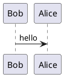

+++
title = "ATOM エディタを使った作図（PlantUML 編）"
date =  "2017-12-17T21:56:39+09:00"
update = "2018-12-27T17:07:42+09:00"
description = "おおっ。流石にクラス図は PlantUML の方がいいな。"
image = "/images/attention/remark.jpg"
tags        = [ "tools", "plantuml", "uml", "atom", "editor", "java" ]

[author]
  name      = "Spiegel"
  url       = "https://baldanders.info/profile/"
  avatar    = "/images/avatar.jpg"
  license   = "by-sa"
  github    = "spiegel-im-spiegel"
  twitter   = "spiegel_2007"
  tumblr    = ""
  instagram = "spiegel_2007"
  flickr    = "spiegel"
  facebook  = "spiegel.im.spiegel"
  linkedin  = "spiegelimspiegel"
  flattr    = ""

[scripts]
  mathjax = false
  mermaidjs = true
+++

[前回]で [ATOM] エディタの掃除も終わったので，以前から気になっていた「[PlantUML] を使った作図」について調べてみた。
ええ，分かってますとも。
[前回]に引き続き「現実逃避」というやつです。

- [Open-source tool that uses simple textual descriptions to draw UML diagrams.](http://plantuml.com/)

## [ATOM] に [PlantUML] 関連パッケージを導入する

[PlantUML] 自体は UML (Unified Modeling Language; 統一モデリング言語) を記述するための DSL (Domain-Specific Language; ドメイン特化言語) と考えてよい（実際には UML 以外のものも記述可能）。
UML の構文（に相当するもの）は図形で表されるが，それをテキストで記述できるようにしたのが [PlantUML] である。
「UML って何？」って方もおられるだろうが，それは[後ほど説明]()する。

直前に述べたように [PlantUML] 自体はテキストで記述するが，最終的には図（diagram）に落とし込むため [Graphviz] と Java の実行環境が必要となる[^jar0]。
これらをあらかじめ導入しておくこと（導入方法については割愛する）。

[^jar0]: [PlantUML] の本体は `plantuml.jar` で提供されている。このファイルを使って “`java -jar plantuml.jar -language`” とコマンドを打つと [PlantUML] で使われる全シンボルが表示される。シーケンス図以外は内部で DOT 言語に変換してから [Graphviz] を使って作図するようだ。

[ATOM] で UML を書く（描く）ために以下の2つのパッケージを導入する。

- [language-plantuml]
- [plantuml-viewer] [^jar1]

[^jar1]: Windows なら `%USERPROFILE%\.atom\packages\plantuml-viewer` フォルダにインストールされるが，その中の `node_modules\node-plantuml` フォルダに `plantuml.jar` がある筈である。

[language-plantuml] は（今のところ）ハイライト機能しかないようなので無くても構わないが， [plantuml-viewer] は描画に必要なので必ず導入すること。

[plantuml-viewer] を導入したら Settings を開いて “Charset” および “Graphviz Dot Executable” 各項目の設定をしておく。



“Graphviz Dot Executable” 項目には [Graphviz] の dot コマンドへのフルパスをセットする。
“Charset” 項目については， [ATOM] で書くんだから UTF-8 にしておけばいいだろう。

## 最初はやっぱり Hello World でしょ

動作確認を兼ねて何か書いてみる。

[language-plantuml] では `.pu`, `.puml`, `.plantuml` を [PlantUML] 用の拡張子と認識するようなので，まずは `hello.puml` ファイルを作って以下のように記述する。

```puml
Bob->Alice : hello
```

これを [plantuml-viewer] で表示する（`ctrl-alt-p` でビュアーが開く）。



おおっ。
できたできた。
表示されている図は PNG, SVG, EPS のいずれかの形式で保存できる（コンテキスト・メニューから “Save As ...” を選択する）。

[PlantUML] は `@startuml ... @enduml` の間を記述領域と見なすようで



と書いても，全く同じ図が出力される。
他形式のドキュメントに埋め込むことを想定してのことだろうが[^embd1]，今回は単純に図が出力できればいいので，以降の記述では `@startuml` および `@enduml` を省くことにする。

[^embd1]: `@startuml` の後ろに `images/hello.png` などと指定すれば `plantuml.jar` のほうで自動的に指定したパス名で画像ファイルを出力するらしい。

## 見た目の調整

このままでもいいっちゃあいいのだが，もう少し見た目をどうにかしたい。
まずはモノクロ表示にしてみる。


skinparam monochrome true
Bob->Alice : hello


これで



という感じにモノクロになった。
調子に乗ってもう少し色々と弄ってみよう。


skinparam shadowing false
skinparam default{
  FontName 'Noto Serif', 'Noto Serif JP', serif
  FontColor black
  FontSize 14
}
skinparam sequence {
  ArrowColor Black
  ArrowFontName 'Noto Sans', 'Noto Sans JP', sans-serif
  ArrowFontColor black
  ArrowFontSize 10
  LifeLineBorderColor Black
  LifeLineBackgroundColor White
  ActorBorderColor Black
  ActorBackgroundColor White
  ParticipantBorderColor Black
  ParticipantBackgroundColor LightGray
  MessageAlign center
}

actor ボブ
participant Alice

ボブ->Alice : こんにちは
activate Alice

Alice-->ボブ : Hello
deactivate Alice


前半部分で線や背景色の色およびフォントについて指定し[^fnt1]，後半部分で実際のシーケンスを記述している。
これを SVG に出力するとこんな感じになる。

[^fnt1]: フォント名については `font-family` としてそのまま SVG に埋め込まれる。従って環境によって見え方が異なる筈である。どの環境でも同じような見え方にしたいなら PNG で保存するのが最も確実だろう。その場合は `xxxFontName` に自マシンにインストールされている具体的なフォント名を指定する必要がある。



見た目の記述に毎回あれだけの量を書くのはかったるいのでインクルードファイルとして別出ししてしまおう。


!include style.puml

actor ボブ
participant Alice

ボブ->Alice : こんにちは
activate Alice

Alice-->ボブ : Hello
deactivate Alice


これでスッキリした。
[`style.puml`](./style.puml) ファイルの中身はこんな感じで，記述をそのままコピっただけ。


skinparam shadowing false
skinparam default{
  FontName 'Noto Serif', 'Noto Serif JP', serif
  FontColor black
  FontSize 14
}
skinparam sequence {
  ArrowColor Black
  ArrowFontName 'Noto Sans', 'Noto Sans JP', sans-serif
  ArrowFontColor black
  ArrowFontSize 10
  LifeLineBorderColor Black
  LifeLineBackgroundColor White
  ActorBorderColor Black
  ActorBackgroundColor White
  ParticipantBorderColor Black
  ParticipantBackgroundColor LightGray
  MessageAlign center
}


## [PlantUML] で作図可能な UML 図 {#uml}

現在 UML 2.0 では以下の図（Diagrams）が定義されている。

- Diagrams
    - 構造図（Structural Diagrams）
        - [クラス図（Class Diagram）](http://plantuml.com/class-diagram)
        - [オブジェクト図（Object Diagram）](http://plantuml.com/object-diagram)
        - パッケージ図（Package Diagram）
        - コンポジット構造図（Composite Structure Diagram）
        - [コンポーネント図（Component Diagram）](http://plantuml.com/component-diagram)
        - [配置図（Deployment Diagram）](http://plantuml.com/deployment-diagram)
    - 振る舞い図（Behavioral Diagrams）
        - [ユースケース図（Use Case Diagram）](http://plantuml.com/use-case-diagram)
        - [アクティビティ図（Activity Diagram）](http://plantuml.com/activity-diagram-beta)
        - [状態遷移図（State Machine Diagram）](http://plantuml.com/state-diagram)
        - [シーケンス図（Sequence Diagram）](http://plantuml.com/sequence-diagram)
        - コミュニケーション図（Communication Diagram）
        - 相互作用概要図（Interaction Overview Diagram）
        - [タイミング図（Timing Diagram）](http://plantuml.com/timing-diagram)

リンクがあるものが [PlantUML] 記述可能な図である。

UML 各図の中の線や図形は全て「意味」が決められており，それらを組み合わせることでシステムの仕様や設計が表現できることを目指している。
名前が示す通りモデリングの設計手法と相性がいいため，オブジェクト指向設計においてよく使われる。

実際には上で挙げた図を全て駆使するのではなく，システムの性格や規模に応じて幾つかの図を組み合わせて使うのが普通である。

UML 図の中でもよく使われるシーケンス図とクラス図について [PlantUML] での記述を紹介しよう。
以前「[そうだ，シーケンス図を描こう！]」の中で， [mermaid] 記法で書いたシーケンス図


sequenceDiagram
    カバ->>+カバン: あなた，泳げまして？
    カバン-->>-カバ: いえ
    カバ->>+カバン: 空は飛べるんですの？
    カバン-->>-カバ: いえ
    カバ->>+カバン: じゃあ，足が速いとか？
    カバン-->>-カバ: いえ
    カバ->>カバン: あなた，何にもできないのねぇ
    loop ひとりヘコむ
        カバン->>カバン: ううっ
    end


を [PlantUML] で作図するとこんな感じだろうか（図のリンク先が [PlantUML] ソースコード）。



じゃあ， [mermaid] 記法で書いたクラス図


classDiagram
    friends<|--serval
    friends<|--raccoon
    friends<|--fennec
    serval : +Waai()
    raccoon : +OmakaseNanoda()
    fennec : +Haiyo()


を [PlantUML] で作図するとこんな感じかな（コメントをちょろんと加えてみた）。



おおっ。
流石にクラス図は [PlantUML] の方がいいな。
矢印は横向きにも出来るっぽい。



今度からクラス図描くときは [PlantUML] で描くようにしよう。

## やっぱり考えながら描く

「[そうだ，シーケンス図を描こう！]」でも書いたんだけど，クラス図やシーケンス図といったものは試行錯誤しながら描いていくものなのよ[^case1]。
お客さんもマネージャもプログラマも UML 図を中心に議論を行っていく。
だから作成や修正が面倒なツールはダメなのだ。
[PlantUML] は時々刻々と修正されることを前提にしたツールと言える。

[^case1]: もちろん UML を CASE (Computer Aided Software Engineering) の入力手段として使う場合もある（つか UML ってそれを念頭に置いて開発されたものだからねぇ）。その場合は矛盾のない正確な記述が要求される。

もうひとつ。

要求定義を行っていくと「要求」やそれに伴う「仕様」が大きく変化することがある。
変化すること自体は（改善されてるってことだし）結構なのだが（予算規模が変わってアワアワする可能性はあるけど），あとからチームに参加する人たちは「結果」しか提示されないので「何故そのような「要求」に至ったか」が理解できないことが多い。
不完全な理解のまま作業をすすめると必ず何処かで不整合が起きる（つまり文脈（context）が大事ってこと）。

だから議論の流れを後から追えるよう「履歴」をとっていく必要がある。
私が最近 UML 図に関して教わったのは

1. 最初は不完全でも間違ってても構わない。まずは考えていることを図にぶちまけることが重要
1. ただし，クラス図では多重度を記述すること（MUST）
1. 要求定義レベルの図と設計レベルの図は必要とされる詳細度や厳密度が異なる。最初から設計レベルの図を描こうとしないこと
1. 作成した図は（手書きのものも含めて）全て履歴として保管し，後から参照できるようにすること

だったかな。

[PlantUML] の利点は，テキストであるが故に修正・変更が容易で， git などのバージョン管理システムと組み合わせて履歴から差分情報を抽出しやすいことにある。
ぶっちゃけ，出力としての PNG や SVG 画像ファイルにはさしたる価値はなく， UML 用の DSL である [PlantUML] の記述にこそ大きな価値があるということだ。

## ブックマーク

- [UML入門 - IT専科](http://www.itsenka.com/contents/development/uml/)
- [Changing colors and fonts](http://plantuml.com/skinparam)
- [PlantUML の使い方 | プログラマーズ雑記帳](http://yohshiy.blog.fc2.com/blog-entry-152.html)
- [PlantUML Cheat Sheet - Qiita](https://qiita.com/ogomr/items/0b5c4de7f38fd1482a48)

- [AtomとPlantUMLで爆速UMLモデリング - Qiita](https://qiita.com/nakahashi/items/3d88655f055ca6a2617c)
- [Atom+PlantUMLで見た目もいい感じのシーケンス図を作成する - Qiita](https://qiita.com/k_nakayama/items/77ca73753ebd049a66de)
- [PlantUMLでER図を描く！ – VELTRA Engineering – Medium](https://medium.com/veltra-engineering/how-to-draw-er-diagram-with-plantuml-86ec2095645e)

[前回]:  "年末なので ATOM Editor を掃除しましょう（もしくは2017年お気に入り ATOM パッケージ）"
[そうだ，シーケンス図を描こう！]:  "そうだ，シーケンス図を描こう！ （一応クラス図も描けるよ）"
[ATOM]: https://atom.io/ "Atom"
[language-plantuml]: https://atom.io/packages/language-plantuml
[linter]: https://atom.io/packages/linter
[plantuml-viewer]: https://atom.io/packages/plantuml-viewer
[PlantUML]: http://plantuml.com/ "Open-source tool that uses simple textual descriptions to draw UML diagrams."
[Graphviz]: http://graphviz.org/ "Graphviz - Graph Visualization Software"
[mermaid]: https://mermaidjs.github.io/
