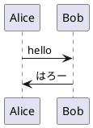

+++
title = "真面目に PlantUML (1) : PlantUML のインストール"
date = "2018-12-27T19:55:14+09:00"
update =  "2018-12-30T16:08:46+09:00"
description = " せっかく時間ができたのだから PlantUML についてちゃんと調べてみることにした。"
image = "/images/attention/kitten.jpg"
tags = [ "java", "plantuml", "uml", "tools" ]

[author]
  name = "Spiegel"
  url = "https://baldanders.info/spiegel/profile/"
  avatar = "/images/avatar.jpg"
  license = "by-sa"
  github = "spiegel-im-spiegel"
  twitter = "spiegel_2007"
  instagram = "spiegel_2007"
  flickr = "spiegel"
  facebook = "spiegel.im.spiegel"

[scripts]
  mathjax = false
  mermaidjs = false
+++

1年ほど前に [ATOM] エディタを使って [PlantUML] を使って UML で遊んだのだが， [PlantUML] 自体は「とりあえず動かしてみた」というレベルできちんと調べていなかった。
せっかく時間ができたのだから，この機会にちゃんと調べてみることにした。

## 目次

1. [PlantUML のインストール]() ← イマココ
1. [シーケンス図]()
1. [クラス図]()

## [PlantUML] のインストール

[PlantUML] は UML (Unified Modeling Language; 統一モデリング言語) を記述するための DSL (Domain-Specific Language; ドメイン特化言語) と考えてよい。
UML の構文（に相当するもの）は図形で表されるが，それをテキストで記述できるようにしたのが [PlantUML] である。
[PlantUML] では UML 2.0 のうち以下の図（Diagrams）を作成できるようだ。

- 構造図（Structural Diagrams）
    - [クラス図（Class Diagram）](http://plantuml.com/class-diagram) ※同じ機能でパッケージ図も作成可能
    - [コンポーネント図（Component Diagram）](http://plantuml.com/component-diagram)
    - [オブジェクト図（Object Diagram）](http://plantuml.com/object-diagram)
    - [配置図（Deployment Diagram）](http://plantuml.com/deployment-diagram)
- 振る舞い図（Behavioral Diagrams）
    - [シーケンス図（Sequence Diagram）](http://plantuml.com/sequence-diagram)
    - [ユースケース図（Use Case Diagram）](http://plantuml.com/use-case-diagram)
    - [アクティビティ図（Activity Diagram）](http://plantuml.com/activity-diagram-beta) ※ベータ版
    - [状態遷移図（State Machine Diagram）](http://plantuml.com/state-diagram)
    - [タイミング図（Timing Diagram）](http://plantuml.com/timing-diagram)

[PlantUML] の実行モジュールは Java の jar ファイルで提供されているため，あらかじめ Java の実行環境を用意する必要がある（最新の [OpenJDK](http://openjdk.java.net/) で問題ない）。
また[シーケンス図](http://plantuml.com/sequence-diagram)と[アクティビティ図](http://plantuml.com/activity-diagram-beta)以外は [DOT 言語]にトランス・コンパイルされるため [Graphviz] もインストールする必要がある。

[PlantUML] の実行モジュールは[ダウンロードページ](http://plantuml.com/download)から最新の `plantuml.jar` ファイルをダウンロードすれば大丈夫。
[Graphviz] も[ダウンロードページ](http://graphviz.org/download/)等から取得できる。
たとえば Windows であれば “Stable 2.38 Windows install packages” をダウンロードしてインストールすればよい。

用意ができたら `plantuml.jar` ファイルのあるフォルダで以下のコマンドを入力し動作確認する（以下は Windows 7 環境下での例）。

```text
$ java -jar plantuml.jar -version
PlantUML version 1.2018.14 (Sat Dec 22 01:33:16 JST 2018)
(GPL source distribution)
Java Runtime: OpenJDK Runtime Environment
JVM: OpenJDK 64-Bit Server VM
Java Version: 11.0.1+13
Operating System: Windows 7
OS Version: 6.1
Default Encoding: MS932
Language: ja
Country: JP
Machine: ********
PLANTUML_LIMIT_SIZE: 4096
Processors: 4
Max Memory: 2,065,694,720
Total Memory: 130,023,424
Free Memory: 123,436,232
Used Memory: 6,587,192
Thread Active Count: 1

The environment variable GRAPHVIZ_DOT has not been set
Dot executable is C:\path\to\dot.exe
Dot version: dot - graphviz version 2.38.0 (20140413.2041)
Installation seems OK. File generation OK
```

`GRAPHVIZ_DOT` 環境変数がないよ，と言っているが [Graphviz] の dot コマンドにパスが通っていれば無問題。
念のため dot コマンドとの連携を確認しておこう。
以下のコマンドを実行する。

```text
$ java -jar plantuml.jar -testdot
The environment variable GRAPHVIZ_DOT has not been set
Dot executable is C:\path\to\dot.exe
Dot version: dot - graphviz version 2.38.0 (20140413.2041)
Installation seems OK. File generation OK
```

## コマンドライン・オプション

[PlantUML] のコマンドライン・オプションは以下の通り。

```text
$ java -jar plantuml.jar -h
Usage: java -jar plantuml.jar [options] -gui
        (to execute the GUI)
        or java -jar plantuml.jar [options] [file/dir] [file/dir] [file/dir]
        (to process files or directories)

You can use the following wildcards in files/dirs:
        *       means any characters but '\'
        ?       one and only one character but '\'
        **      means any characters (used to recurse through directories)

where options include:

        -gui                To run the graphical user interface
        -tpng               To generate images using PNG format (default)
        -tsvg               To generate images using SVG format
        -teps               To generate images using EPS format
        -tpdf               To generate images using PDF format
        -tvdx               To generate images using VDX format
        -txmi               To generate XMI file for class diagram
        -tscxml             To generate SCXML file for state diagram
        -thtml              To generate HTML file for class diagram
        -ttxt               To generate images with ASCII art
        -tutxt              To generate images with ASCII art using Unicode characters
        -tlatex             To generate images using LaTeX/Tikz format
        -tlatex:nopreamble  To generate images using LaTeX/Tikz format without preamble
        -o[utput] "dir"     To generate images in the specified directory
        -DVAR1=value        To set a preprocessing variable as if '!define VAR1 value' were used
        -Sparam1=value      To set a skin parameter as if 'skinparam param1 value' were used
        -r[ecurse]          recurse through directories
        -I\path\to\file     To include file as if '!include file' were used
        -I\path\to\*.puml   To include files with pattern
        -charset xxx        To use a specific charset (default is windows-31j)
        -e[x]clude pattern  To exclude files that match the provided pattern
        -metadata           To retrieve PlantUML sources from PNG images
        -nometadata         To NOT export metadata in PNG/SVG generated files
        -checkmetadata      Skip PNG files that don't need to be regenerated
        -version            To display information about PlantUML and Java versions
        -checkversion       To check if a newer version is available for download
        -v[erbose]          To have log information
        -quiet              To NOT print error message into the console
        -debugsvek          To generate intermediate svek files
        -h[elp]             To display this help message
        -testdot            To test the installation of graphviz
        -graphvizdot "exe"  To specify dot executable
        -p[ipe]             To use stdin for PlantUML source and stdout for PNG/SVG/EPS generation
        -encodesprite 4|8|16[z] "file"      To encode a sprite at gray level (z for compression) from an image
        -computeurl|-encodeurl      To compute the encoded URL of a PlantUML source file
        -decodeurl          To retrieve the PlantUML source from an encoded URL
        -syntax             To report any syntax error from standard input without generating images
        -language           To print the list of PlantUML keywords
        -checkonly          To check the syntax of files without generating images
        -failfast           To stop processing as soon as a syntax error in diagram occurs
        -failfast2          To do a first syntax check before processing files, to fail even faster
        -pattern            To print the list of Regular Expression used by PlantUML
        -duration           To print the duration of complete diagrams processing
        -nbthread N         To use (N) threads for processing
        -nbthread auto      To use 4 threads for processing
        -timeout N          Processing timeout in (N) seconds. Defaults to 15 minutes (900 seconds).
        -author[s]          To print information about PlantUML authors
        -overwrite          To allow to overwrite read only files
        -printfonts         To print fonts available on your system
        -enablestats        To enable statistics computation
        -disablestats       To disable statistics computation (default)
        -htmlstats          To output general statistics in file plantuml-stats.html
        -xmlstats           To output general statistics in file plantuml-stats.xml
        -realtimestats      To generate statistics on the fly rather than at the end
        -loopstats          To continuously print statistics about usage
        -splash             To display a splash screen with some progress bar
        -progress           To display a textual progress bar in console
        -pipeimageindex N   To generate the Nth image with pipe option
        -stdlib             To print standart library info
        -extractstdlib      To extract PlantUML Standard Library into stdlib folder
        -filename "example.puml"    To override %filename% variable
        -preproc            To output preprocessor text of diagrams
        -cypher             To cypher texts of diagrams so that you can share them

If needed, you can setup the environment variable GRAPHVIZ_DOT.
```

かなりの数のオプションがあるが，よく使うのは以下のものだろうか。

| オプション           | 内容                                      |
| -------------------- | ----------------------------------------- |
| `-tpng`              | PNG 形式で出力（既定値）                  |
| `-tsvg`              | SVG 形式で出力                            |
| `-teps`              | EPS 形式で出力                            |
| `-tpdf`              | PDF 形式で出力                            |
| `-tlatex`            | LaTeX/Tikz 形式で出力                     |
| `-tlatex:nopreamble` | LaTeX/Tikz 形式で出力（プリアンブルなし） |
| `-o[utput] "dir"`    | 指定したフォルダに出力                    |
| `-charset xxx`       | 文字エンコーディングの指定                |
| `-nometadata`        | PNG/SVG 出力にメタデータを含めない        |
| `-p[ipe]`            | 入出力をパイプで行う                      |

## みんな大好き Hello World

では簡単なコードを処理してみよう。

`hello.puml` という名前のファイルを用意して以下のように入力する。



[PlantUML] ではドキュメントの中にコードを埋め込むことを想定して `@startuml ... @enduml` 内の記述のみが処理の対象となる。

ではこのファイルを処理してみよう。

```text
$ java -jar plantuml.jar -charset UTF-8 hello.puml
```

これで `hello.puml` と同じフォルダに `hello.png` ファイルが出力される。
`hello.png` ファイルの内容は以下の通り。



って，ちっちゃ！
じゃあ，解像度を調節してもう少し大きくしてみよう。


@startuml

skinparam dpi 300

Alice->Bob : hello
Alice<-Bob : はろー

@enduml


これを処理するとこうなる。



おおっ。
おっきくなった。

## 見た目の調整

上の例で示したように [PlantUML] では `skinparam` コマンドを使って見た目の調整ができる。
では，もう少し調整を入れて UML っぽい図にしてみる。


@startuml

skinparam shadowing false
skinparam backgroundColor transparent
skinparam dpi 300

skinparam arrow {
  FontColor Black
  FontName Noto Serif JP
  FontSize 10
  FontStyle plain
  Color Black
  Thickness 1
}
skinparam participant {
  FontColor Black
  FontName Noto Sans
  FontSize 14
  FontStyle plain
  BackgroundColor WhiteSmoke
  BorderColor Black
  BorderThickness 1
  Padding 20
}
skinparam sequence {
  LifeLineBackgroundColor transparent
  LifeLineBorderColor Black
  LifeLineBorderThickness 1
  MessageAlignment center
}
hide footbox
skinparam BoxPadding 10

Alice->Bob : hello
Alice<-Bob : はろー

@enduml


フォントの変更と線の色と太さを調節してみた。
またライフラインの間隔も調整している。
以上を処理するとこんな図になる。



## 見た目の指定を別ファイルに分離する

見た目の指定は別ファイルにして再利用したいところである。
そこで `hello.iuml` ファイルを作成して `skinparam` コマンドの内容をまるっと移動してみる。

```puml
skinparam shadowing false
skinparam backgroundColor transparent
skinparam dpi 300

skinparam arrow {
  FontColor Black
  FontName Noto Serif JP
  FontSize 10
  FontStyle plain
  Color Black
  Thickness 1
}
skinparam participant {
  FontColor Black
  FontName Noto Sans
  FontSize 14
  FontStyle plain
  BackgroundColor WhiteSmoke
  BorderColor Black
  BorderThickness 1
  Padding 20
}
skinparam sequence {
  LifeLineBackgroundColor transparent
  LifeLineBorderColor Black
  LifeLineBorderThickness 1
  MessageAlignment center
}
hide footbox
skinparam BoxPadding 10
```

このファイルをインクルードする形でコードを修正する。


@startuml

!include hello.iuml

Alice->Bob : hello
Alice<-Bob : はろー

@enduml


これを処理すると



先程と全く同じ結果が得られる。

また最初の


に対して

```text
$ java -jar plantuml.jar -charset UTF-8 -config hello.iuml hello.puml
```

と `-config` オプションで `hello.iuml` ファイルを指定しても同じ結果が得られる。
これで再利用しやすくなっただろう。

## 【追記】 [PlantUML] のコメント

[PlantUML] の `@startuml ... @enduml` 領域内にコメントを記述する際には以下の２通りの書き方がある。

```puml
@startuml

' 一行コメント

/'
複数行に渡る
コメント
'/

@enduml
```

なお，行の途中に

```puml
@startuml

skinparam dpi 300 '解像度の設定

@enduml
```

のような記述はできない（しかもエラーにもならない）のでご注意を。

## ブックマーク

- [UML入門 - IT専科](http://www.itsenka.com/contents/development/uml/)
- [Changing colors and fonts](http://plantuml.com/skinparam)
- [call it from your script using command line](http://plantuml.com/command-line)
- [PlantUML の使い方 | プログラマーズ雑記帳](http://yohshiy.blog.fc2.com/blog-entry-152.html)


[ATOM]: https://atom.io/ "Atom"
[PlantUML]: http://plantuml.com/ "Open-source tool that uses simple textual descriptions to draw UML diagrams."
[Graphviz]: http://graphviz.org/ "Graphviz - Graph Visualization Software"
[DOT 言語]: https://graphviz.gitlab.io/_pages/doc/info/lang.html "The DOT Language"
