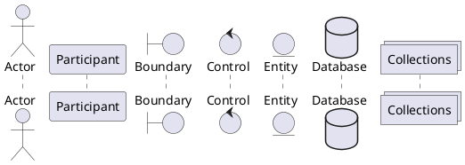
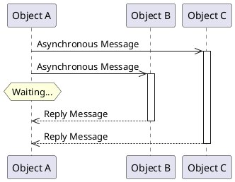
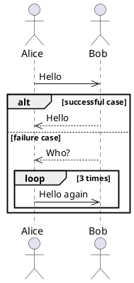

+++
title = "真面目に PlantUML (2) : シーケンス図"
date = "2018-12-28T18:18:03+09:00"
update = "2018-12-29T18:11:06+09:00"
description = "さっそく今回はシーケンス図を PlantUML で書いてみようか。"
image = "/images/attention/kitten.jpg"
tags = [ "plantuml", "uml", "tools" ]

[author]
  name      = "Spiegel"
  url       = "https://baldanders.info/spiegel/profile/"
  avatar    = "/images/avatar.jpg"
  license   = "by-sa"
  github    = "spiegel-im-spiegel"
  twitter   = "spiegel_2007"
  instagram = "spiegel_2007"
  flickr    = "spiegel"
  facebook  = "spiegel.im.spiegel"

[scripts]
  mathjax = false
  mermaidjs = false
+++

[前回]でインストールまで終わったので，今回から各図の書き方について記しておく。
なお，今回から `skinparam` 定義をまとめた [`skinparams.iuml`] ファイルを用意し，このファイルを食わせることで見た目の調整を行うことにする。

```text
$ java -Dfile.encoding=UTF-8 -jar plantuml.jar -nometadata -charset UTF-8 -config skinparams.iuml *.puml
```

さっそく今回はシーケンス図を [PlantUML] で書いてみようか。

## 目次

1. [PlantUML のインストール]()
1. [シーケンス図]() ← イマココ
1. [クラス図]()

## オブジェクトとライフライン

UML のシーケンス図（sequence diagram）はオブジェクト同士のやり取り（相互作用）を時系列で表したものである。
オブジェクトの粒度は設計により様々で，人やシステムを表す場合もあればクラス単位の場合もある。
たとえば Alice と Bob が挨拶を交わす場合は



と表す。
上の矩形がオブジェクトを表す。
そこから真下に伸びる点線は「ライフライン（lifeline）」と呼ばれているもので，上から下に時間が進行している。
横向きの矢印は「メッセージ（message）」と呼ばれていて，一方のオブジェクトからもう一方へ何らかのアクションを起こしたことを示している。

上図の場合は，まず Alice から Bob へ “hello” を行い，その後に Bob から Alice へ “hello” を行ったことを表す。
ただし，この時点では2つの “hello” に関係があるかどうかは分からない。

UML のシーケンス図ではオブジェクトは矩形で表されるが [PlantUML] には以下の図形も用意されている[^obj1]。

[^obj1]: [PlantUML] では記述のかなりの部分を省略できるが，そのせいで文脈依存にならざるを得ない。たとえば `Alice->Bob` とだけ記述した場合，それがシーケンス図を表すのかクラス図なのか，あるいは他の図なのか分かりにくい（[PlantUML] はシーケンス図判定の優先度が高いようだが仕様として明記されていない）。そこで [PlantUML] でオブジェクトを定義する際は “`actor Alice`” のように常に種別を明記する癖をつけておくと（後に再利用する上でも）いいだろう。





## メインフレーム

全体を囲むフレームを表示する場合には `mainframe` で指定する。


@startuml

mainframe sd Hello World

participant Alice
participant Bob

Alice->>Bob : hello
Alice<<-Bob : hello

@enduml




## メッセージ詳細

シーケンス図におけるメッセージのやりとりについて，いくつかパターンを書いてみる。

### 同期メッセージ（Synchronous Message）


@startuml

participant "Object A" as A
participant "Object B" as B

A -> B : Synchronous Message
activate B

B -> B : Internal call

A <<-- B : Reply Message
deactivate B

@enduml




矢印の種類に注意。

「メッセージ」となっているが必ずしも通信を行っているわけではなく，相手オブジェクトのメソッドを呼び出す場合もこのような記述になる。

Object B のライフラインにある縦長の矩形は「実行仕様（execution specification）」と呼ばれるもので，その期間中に何らかの処理を行っていることを示す。
[PlantUML] では `activate`/`deactivate` で指定可能（直前のメッセージがトリガとなる）。
Object B は Object A からのメッセージを受けて内部処理を行って結果を Object A に返しているわけやね。

### 非同期メッセージ（Asynchronous Message）





矢印の種類，特に同期メッセージとの違いに注意。

Object A と Object B の間，および Object A と Object C の間は同期していないため，処理の終了を待っているわけですね。
分かります。
ちなみに `hnote` はコメントを表す。
`note` だと付箋紙っぽい図形だが `hnote` なら六角形（hexagon）になる。

### メッセージの不達


@startuml

participant "Object A" as A
participant "Object B" as B

A ->> B : Asynchronous Message
activate B

hnote over A : Waiting...

A x<-- B : No Reply
deactivate B

hnote over A : Timeout

@enduml




異常系シーケンスでよく見かけるやつ。
この例は Object B からの応答がなくてタイムアウトしちゃった状態を表す。

### スコープ外からのメッセージ（Found/Lost Message）


@startuml

participant "Object A" as A
participant "Object B" as B

[o->> A : Found Message
activate A

A -> B : Synchronous Message
activate B

B -> B : Internal call
activate B

B ->>o] : Lost Message
deactivate B

A <<-- B : Reply Message
deactivate B

@enduml




スコープ外のオブジェクトとのやり取りを表す。
メッセージがロストしているわけではない。
本当は黒丸なんだけど，何故か黒丸が使えない。

## 複合フラグメント（Combined Fragment）

シーケンス図で条件分岐やループなどの制御構造を表現するために以下のような「複合フラグメント」を記述できる。





この例では `alt ... else ... end`, `loop ... end` で囲まれた部分が複合フラグメントに相当する。

[PlantUML] では複合フラグメントとして以下のものが使える（`group` は汎用）。

| Operator   | [PlantUML]       | 意味                                                  |
| ---------- | ---------------- | ----------------------------------------------------- |
| `alt`      | `alt`/`else`     | **Alternative** 指定した条件下で分岐処理              |
| `opt`      | `opt`            | **Option** 指定した条件下で行う処理                   |
| `loop`     | `loop`           | **Loop** 指定した条件下で繰り返し処理                 |
| `break`    | `break`          | **Break** 指定した条件下で中断処理                    |
| `par`      | `par`/`else`     | **Parallel** 並列処理                                 |
| `critical` | `critical`       | **Critical** クリティカル・セッション                 |
| `ignore`   | `group ignore`   | **Ignore** 無効な処理または重要でない処理             |
| `consider` | `group consider` | **Consider** 有効な処理または重要な処理               |
| `assert`   | `group assert`   | **Assert** 処理が成り立つために条件が必要なことを示す |
| `neg`      | `group neg`      | **Negation** 本来起こりえない処理                     |

### 外部参照

複合フラグメントとはちょっと違うが [PlantUML] では `ref` を使ってシーケンスの一部を外部参照として表せる。
使い方は `note`/`hnote` と同じ。


@startuml

participant "Object A" as A
participant "Object B" as B

A -> B : Request

ref over A,B
  Initialize
end ref

A <<-- B : Complete

@enduml




これでシーケンス図を機能ごとに分解することが可能になる。

## オブジェクトの生成と消滅

[PlantUML] では `create`/`destroy` を使って以下のようにオブジェクトの生成と消滅を記述できる。


@startuml

participant "Object A" as A
participant "Object B" as B
participant "Object C" as C

== Create Object ==

A -> B: Create Object C
activate B

create C
B->C: Create

ref over B, C : Initialize

A <<-- B: Success
deactivate B

|||
== Destroy Object ==

A -> B: Destroy Object C
activate B

B->C: Destroy
activate C

B<<--C: Done
deactivate C
destroy C

A <<-- B: Success
deactivate B

@enduml





んー。
バツの付く位置が違うような気がするが，まぁいいか。

今日のところはこれで。

## ブックマーク

- [Sequence Diagram syntax and features](http://plantuml.com/sequence-diagram)
- [シーケンス図(Sequence Diagram) - UML入門 - IT専科](http://www.itsenka.com/contents/development/uml/sequence.html)

- [GitHub - spiegel-im-spiegel/plantuml-sample: Samples for PlantUML](https://github.com/spiegel-im-spiegel/plantuml-sample)

[前回]:  "真面目に PlantUML (1) : PlantUML のインストール"
[PlantUML]: http://plantuml.com/ "Open-source tool that uses simple textual descriptions to draw UML diagrams."
[`skinparams.iuml`]: https://github.com/spiegel-im-spiegel/plantuml-sample/blob/master/skinparams.iuml "plantuml-sample/skinparams.iuml at master · spiegel-im-spiegel/plantuml-sample"
