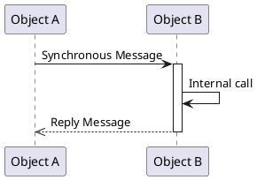
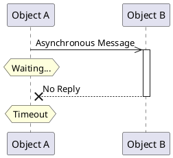
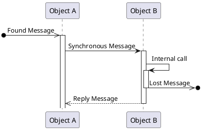
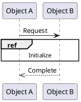
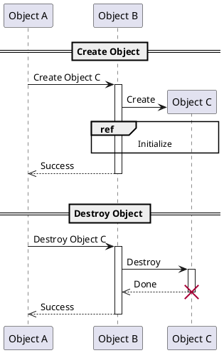

+++
title = "真面目に PlantUML (2) : シーケンス図"
date = "2018-12-28T18:18:03+09:00"
description = "さっそく今回はシーケンス図を PlantUML で書いてみようか。"
image = "/images/attention/kitten.jpg"
tags = [ "java", "plantuml", "uml", "tools" ]

[author]
  name      = "Spiegel"
  url       = "http://www.baldanders.info/spiegel/profile/"
  avatar    = "/images/avatar.jpg"
  license   = "by-sa"
  github    = "spiegel-im-spiegel"
  twitter   = "spiegel_2007"
  instagram = "spiegel_2007"
  flickr    = "spiegel"
  facebook  = "spiegel.im.spiegel"

[scripts]
  mathjax = false
  mermaidjs = false
+++

[前回]でインストールまで終わったので，今回から各図の書き方について記しておく。
なお，今回から `skinparam` 定義をまとめた [`skinparams.iuml`] ファイルを用意し，このファイルを食わせることで見た目の調整を行うことにする。

```text
$ java -Dfile.encoding=UTF-8 -jar plantuml.jar -nometadata -charset UTF-8 -config skinparams.iuml *.puml
```

さっそく今回はシーケンス図を [PlantUML] で書いてみようか。

## 目次

1. [PlantUML のインストール]()
1. [シーケンス図]() ← イマココ

## オブジェクトとライフライン

UML のシーケンス図（sequence diagram）はオブジェクト同士のやり取り（相互作用）を時系列で表したものである。
オブジェクトの粒度は設計により様々で，人やシステムを表す場合もあればクラス単位の場合もある。
たとえば Alice と Bob が挨拶を交わす場合は



と表す。
上の矩形がオブジェクトを表す。
そこから真下に伸びる点線は「ライフライン（lifeline）」と呼ばれているもので，上から下に時間が進行している。
横向きの矢印は「メッセージ（message）」と呼ばれていて，一方のオブジェクトからもう一方へ何らかのアクションを起こしたことを示している。

上図の場合は，まず Alice から Bob へ “hello” を行い，その後に Bob から Alice へ “hello” を行ったことを表す。
ただし，この時点では2つの “hello” に関係があるかどうかは分からない。

UML のシーケンス図ではオブジェクトは矩形で表されるが [PlantUML] には以下の図形も用意されている[^obj1]。

[^obj1]: [PlantUML] では記述のかなりの部分を省略できるが，そのせいで文脈依存にならざるを得ない。たとえば `Alice->Bob` とだけ記述した場合，それがシーケンス図を表すのかクラス図なのか，あるいは他の図なのか分かりにくい（[PlantUML] はシーケンス図判定の優先度が高いようだが仕様として明記されていない）。そこで [PlantUML] でオブジェクトを定義する際は “`actor Alice`” のように常に種別を明記する癖をつけておくと（後に再利用する上でも）いいだろう。




本来ならシーケンス図はこんな感じの



フレームで囲む必要があるが [PlantUML] にはこれに該当するものが用意されていない。
まぁ実務で作図したときもシーケンス図をちゃんとフレームで囲ってるのをあまり見なかったので，気にする人はいないのだろう。

## メッセージ詳細

ではシーケンス図におけるメッセージのやりとりについて，いくつかパターンを書いてみよう。

### 同期メッセージ（Synchronous Message）





矢印の種類に注意。

「メッセージ」となっているが必ずしも通信を行っているわけではなく，相手オブジェクトのメソッドを呼び出す場合もこのような記述になる。

Object B のライフラインにある縦長の矩形は「実行仕様（execution specification）」と呼ばれるもので，その期間中に何らかの処理を行っていることを示す。
Object B は Object A からのメッセージを受けて内部処理を行って結果を Object A に返しているわけやね。

### 非同期メッセージ（Asynchronous Message）




矢印の種類，特に同期メッセージとの違いに注意。

Object A と Object B の間，および Object A と Object B の間は同期していないため，処理の終了を待っているわけですね。
分かります。

### メッセージの不達





異常系シーケンスでよく見かけるやつ。
Object B からの応答がなくてタイムアウトしちゃったとか。

### スコープ外からのメッセージ（Found/Lost Message）





図のスコープ外とのやり取り。
メッセージがロストしているわけではない。
本当は黒丸なんだけど，何故か黒丸が使えない。

## 複合フラグメント（Combined Fragment）

シーケンス図で条件分岐やループなどの制御構造を表現するために以下のような「複合フラグメント」を記述できる。




複合フラグメントとして以下のものがある。

| Operator   | [PlantUML]       | 意味                                                  |
| ---------- | ---------------- | ----------------------------------------------------- |
| `alt`      | `alt`/`else`     | **Alternative** 指定した条件下で分岐処理              |
| `opt`      | `opt`            | **Option** 指定した条件下で行う処理                   |
| `loop`     | `loop`           | **Loop** 指定した条件下で繰り返し処理                 |
| `break`    | `break`          | **Break** 指定した条件下で中断処理                    |
| `par`      | `par`/`else`     | **Parallel** 並列処理                                 |
| `critical` | `critical`       | **Critical** クリティカル・セッション                 |
| `ignore`   | `group ignore`   | **Ignore** 無効な処理または重要でない処理             |
| `consider` | `group consider` | **Consider** 有効な処理または重要な処理               |
| `assert`   | `group assert`   | **Assert** 処理が成り立つために条件が必要なことを示す |
| `neg`      | `group neg`      | **Negation** 本来起こりえない処理                     |

### 外部参照

複合フラグメントとはちょっと違うが， `ref` を使ってシーケンスの一部を外部参照にできる。





これでシーケンス図を機能ごとに分解することが可能になる。

## オブジェクトの生成と消滅

`create`/`destroy` を使って以下のようにオブジェクトの生成と消滅を記述できる。





んー。
バツの付く位置が違うような気がするが，まぁいいか。

今日のところはこれで。

## ブックマーク

- [Sequence Diagram syntax and features](http://plantuml.com/sequence-diagram)
- [シーケンス図(Sequence Diagram) - UML入門 - IT専科](http://www.itsenka.com/contents/development/uml/sequence.html)

- [GitHub - spiegel-im-spiegel/plantuml-sample: Samples for PlantUML](https://github.com/spiegel-im-spiegel/plantuml-sample)

[前回]:  "真面目に PlantUML (1) : PlantUML のインストール"
[PlantUML]: http://plantuml.com/ "Open-source tool that uses simple textual descriptions to draw UML diagrams."
[`skinparams.iuml`]: https://github.com/spiegel-im-spiegel/plantuml-sample/blob/master/skinparams.iuml "plantuml-sample/skinparams.iuml at master · spiegel-im-spiegel/plantuml-sample"
