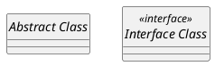
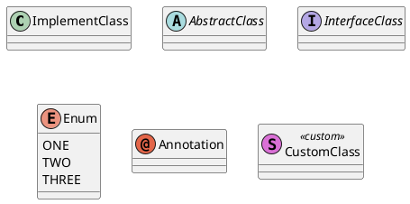
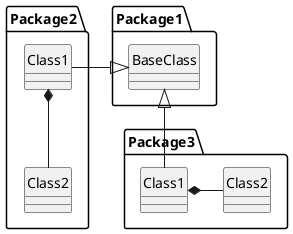
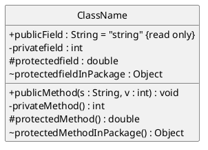
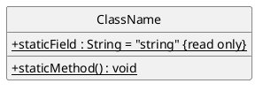
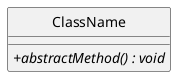
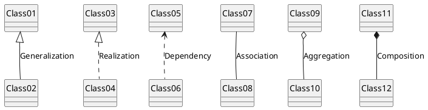
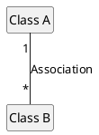

+++
title = "真面目に PlantUML (3) : クラス図"
date = "2018-12-29T18:11:06+09:00"
description = "今回はクラス図について。 オブジェクト図やパッケージ図までだどりつけなかった orz"
image = "/images/attention/kitten.jpg"
tags = [ "tools", "plantuml", "uml", "class" ]

[scripts]
  mathjax = false
  mermaidjs = false
+++

今回はクラス図（class diagram）について。
クラス図はシステムの構成要素であるクラスを定義しクラス同士の関係を表現したものである。

## 目次

1. [PlantUML のインストール]()
1. [シーケンス図]()
1. [クラス図]() ← イマココ
1. [実体関連図]()

## クラスの定義

まずはクラスの定義から。

クラスはひとつの「名前」，0個以上の「属性」，0個以上の「操作」で構成され，以下のように表す。

```puml
@startuml

hide circle

class "Class Name" as Class {
  {field} Attributes
  {method} Operations
}

@enduml
```





抽象クラスの場合は「名前」をイタリック（または斜体）で表す。
[PlantUML] では `abstract` を付けることで抽象クラスとして扱われる。





`<<interface>>` はステレオタイプ（stereotype）と呼ばれているもので，ここではクラスの種別を表している。

なお [PlantUML] ではアイコンを使ってクラス種別を表現できる。





最後の CustomClass ではアイコンをカスタムで指定している。

<!--
## 名前とパッケージ

UML ではクラスの「名前」を

```text
パッケージ名:クラス名
```

で表記する。
ただしパッケージ名は省略可能。

[PlantUML] では “`.`” をデリミタとしてパッケージとクラス名を分離することもできる。




-->

### 属性（attribute），操作（operation），可視性（Visibility）

UML ではクラス内の「属性」を以下のように表記する。

```text
可視性 名前:型 [=初期値] {制約条件}
```

「操作」も同じように

```text
可視性 名前([引数の名前:引数の型[, ...]]) : 戻り値の型
```

と表記する。

「可視性」は属性・操作にアクセスできるスコープを示し，以下の記号で表す。

| 可視性 | スコープ                                             |
| ------ | ---------------------------------------------------- |
| `+`    | **Private** 自クラスでのみアクセス可能               |
| `-`    | **Public** 全てのパッケージ・クラスでアクセス可能    |
| `#`    | **Protected** 自クラスとその派生クラスでアクセス可能 |
| `~`    | **Package Protected** 同じパッケージ内でアクセス可能 |

[PlantUML] では以下のように記述する。





さらに `classAttributeIconSize` を指定して可視性の部分をアイコン化することもできる。


@startuml

show circle
skinparam classAttributeIconSize 10

class ClassName {
  {field} + publicField : String = "string" {read only}
  {field} - privatefield : int
  {field} # protectedfield : double
  {field} ~ protectedfieldInPackage : Object

  {method} + publicMethod(s : String, v : int) : void
  {method} - privateMethod() : int
  {method} # protectedMethod() : double
  {method} ~ protectedMethodInPackage() : Object
}

@enduml




### クラス変数，クラス・メソッド

クラス変数やクラス・メソッドはアンダーラインで表す。
[PlantUML] では `static` または `classifier` を付けることでクラス変数やクラス・メソッドであることを示す。





### 抽象メソッド

抽象メソッドはイタリック（または斜体）で表す。
[PlantUML] では `abstract` を付けることで抽象メソッドであることを示す。





[PlantUML] はクラス・メンバについてかなりアドホックに記述できるため，とりあえずメモ書きを残しておいて，あとから厳密に決めていくのがいいかも知れない。

## クラス間の関係

クラス間の関係はクラス同士を線で繋いで表すが，線（矢印）の種類によって関係の違いを表現できる。






それぞれの意味は以下の通り

| 種別           | 意味                                                                          |
| -------------- | ----------------------------------------------------------------------------- |
| Generalization | **汎化** いわゆる is-a 関係がある                                             |
| Realization    | **実現** interface 型のような抽象クラスとの汎化関係がある                     |
| Dependency     | **依存** 矢印の相手に対して依存関係がある                                     |
| Association    | **関連** クラス間で関連がある                                                 |
| Aggregation    | **集約**  関連の一種で，全体-部分の関係がある                                 |
| Composition    | **コンポジション** 集約の一種だが片方のみでは成り立たないような強い関係を示す |

### 多重度（Multiplicity）

関連する2つのクラスについて多重度を設定する。
たとえば Class A と Class B の間に 1:多 の関係があるなら





などと記述する。
多重度表記とその意味は以下の通り。

| 多重度        | 意味          |
| ------------- | ------------- |
| `1`           | 1つのみ       |
| `0,1`         | ゼロまたは1つ |
| `0..n` or `n` | ゼロ以上多数  |
| `1..n`        | 1以上多数     |
| `*`           | `n` と同じ    |

### クラス図を使った設計では多重度の決定が最優先

クラス図を使って設計を行う場合は多重度を最優先で考える。
すなわち

1. システムに必要なクラスを列挙する
2. 関連のあるクラスを線で繋ぐ
3. 繋がっているクラスについて多重度を決定する
4. クラスの種別を決定する
5. クラス・メンバを検討する

という順番で考えていくとよいだろう。

## ブックマーク

- [Class Diagram syntax and features](http://plantuml.com/class-diagram)
- [Class Diagram Tutorial](https://online.visual-paradigm.com/tutorials/class-diagram-tutorial/)
- [クラス図(Class Diagram) - UML入門 - IT専科](http://www.itsenka.com/contents/development/uml/class.html)
- [PlantUMLがいつのまにかLolipop表記に対応していた件](https://zenn.dev/buchio/articles/b897c0377875043b85db)

- [spiegel-im-spiegel/plantuml-sample: Samples for PlantUML](https://github.com/spiegel-im-spiegel/plantuml-sample)

[PlantUML]: http://plantuml.com/ "Open-source tool that uses simple textual descriptions to draw UML diagrams."
[`skinparams.iuml`]: https://github.com/spiegel-im-spiegel/plantuml-sample/blob/master/skinparams.iuml "plantuml-sample/skinparams.iuml at master · spiegel-im-spiegel/plantuml-sample"
