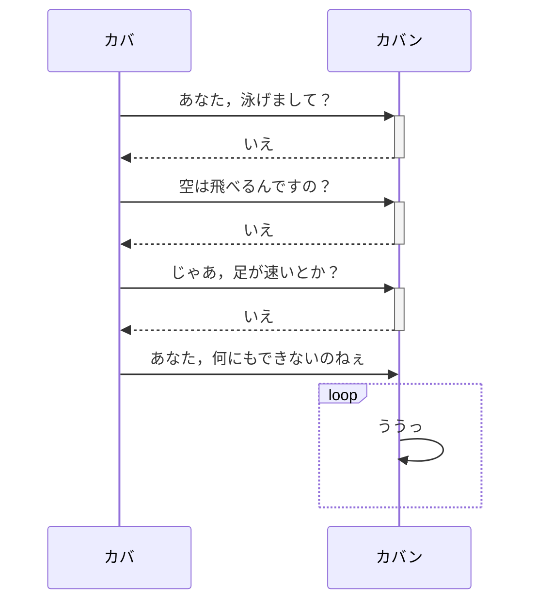

+++
title = "Hugo で Markdeep な記述ができるようになった"
date =  "2022-03-06T10:53:56+09:00"
description = "レンダー・フックを使って Mermaid にも対応できる。"
image = "/images/attention/kitten.jpg"
tags = [ "hugo", "mermaid" ]
pageType = "text"

[scripts]
  mathjax = false
  mermaidjs = true
+++

先日 [Hugo] v0.93 がリリースされたが，このバージョンで [Markdeep] な記述にネイティブ対応したそうだ。


**Markdown diagrams and code block render hooks.** Now it's possible create custom templates for Markdown code blocks, either for all or just for specific programming languages. This can also be used to render diagrams from Markdown code blocks. We provide GoAT (Go ASCII Tool) natively from Hugo, but you can also add your own template to get [Mermaid](https://github.blog/2022-02-14-include-diagrams-markdown-files-mermaid/) support. The implementation of GoAT is a Go implementation by [@blampe](https://github.com/gohugoio/hugo/releases/tag/v0.93.0) of [markdeep.mini.js](https://github.com/gohugoio/hugo/releases/tag/v0.93.0)' diagrams. See the [diagram documentation](https://gohugo.io/content-management/diagrams/) for details.


[GoAT (Go ASCII Tool)][GoAT] は [Markdeep] を Go で実装し直したものだそうで，たとえば


```goat
+-------------------+                           ^                      .---.
|    A Box          |__.--.__    __.-->         |      .-.             |   |
|                   |        '--'               v     | * |<---        |   |
+-------------------+                                  '-'             |   |
                       Round                                       *---(-. |
  .-----------------.  .-------.    .----------.         .-------.     | | |
 |   Mixed Rounded  | |         |  / Diagonals  \        |   |   |     | | |
 | & Square Corners |  '--. .--'  /              \       |---+---|     '-)-'       .--------.
 '--+------------+-'  .--. |     '-------+--------'      |   |   |       |        / Search /
    |            |   |    | '---.        |               '-------'       |       '-+------'
    |<---------->|   |    |      |       v                Interior                 |     ^
    '           <---'      '----'   .-----------.              ---.     .---       v     |
 .------------------.  Diag line    | .-------. +---.              \   /           .     |
 |   if (a > b)     +---.      .--->| |       | |    | Curved line  \ /           / \    |
 |   obj->fcn()     |    \    /     | '-------' |<--'                +           /   \   |
 '------------------'     '--'      '--+--------'      .--. .--.     |  .-.     +Done?+-'
    .---+-----.                        |   ^           |\ | | /|  .--+ |   |     \   /
    |   |     | Join        \|/        |   | Curved    | \| |/ | |    \    |      \ /
    |   |     +---->  o    --o--        '-'  Vertical  '--' '--'  '--  '--'        +  .---.
 <--+---+-----'       |     /|\                                                    |  | 3 |
                      v                             not:line    'quotes'        .-'   '---'
  .-.             .---+--------.            /            A || B   *bold*       |        ^
 |   |           |   Not a dot  |      <---+---<--    A dash--is not a line    v        |
  '-'             '---------+--'          /           Nor/is this.            ---
```


てな感じにコード・ブロックで囲って `goat` キーワードを付ければ


```goat
+-------------------+                           ^                      .---.
|    A Box          |__.--.__    __.-->         |      .-.             |   |
|                   |        '--'               v     | * |<---        |   |
+-------------------+                                  '-'             |   |
                       Round                                       *---(-. |
  .-----------------.  .-------.    .----------.         .-------.     | | |
 |   Mixed Rounded  | |         |  / Diagonals  \        |   |   |     | | |
 | & Square Corners |  '--. .--'  /              \       |---+---|     '-)-'       .--------.
 '--+------------+-'  .--. |     '-------+--------'      |   |   |       |        / Search /
    |            |   |    | '---.        |               '-------'       |       '-+------'
    |<---------->|   |    |      |       v                Interior                 |     ^
    '           <---'      '----'   .-----------.              ---.     .---       v     |
 .------------------.  Diag line    | .-------. +---.              \   /           .     |
 |   if (a > b)     +---.      .--->| |       | |    | Curved line  \ /           / \    |
 |   obj->fcn()     |    \    /     | '-------' |<--'                +           /   \   |
 '------------------'     '--'      '--+--------'      .--. .--.     |  .-.     +Done?+-'
    .---+-----.                        |   ^           |\ | | /|  .--+ |   |     \   /
    |   |     | Join        \|/        |   | Curved    | \| |/ | |    \    |      \ /
    |   |     +---->  o    --o--        '-'  Vertical  '--' '--'  '--  '--'        +  .---.
 <--+---+-----'       |     /|\                                                    |  | 3 |
                      v                             not:line    'quotes'        .-'   '---'
  .-.             .---+--------.            /            A || B   *bold*       |        ^
 |   |           |   Not a dot  |      <---+---<--    A dash--is not a line    v        |
  '-'             '---------+--'          /           Nor/is this.            ---
```



と SVG 画像に変換してくれる。
ページのスタイルに合わせてくれるのも嬉しい。

また [Hugo] のレンダー・フックを使って [Mermaid] にも対応できる。

まず，各 Web ページの `<body>` 要素内にあらかじめ

```html
<body>
  ...
  <script src="https://cdn.jsdelivr.net/npm/mermaid/dist/mermaid.min.js"></script>
  <script>
    mermaid.initialize({startOnLoad: true, fontFamily: "sans-serif", theme: "dark", sequence: {height: 40, mirrorActors: false}});
  </script>
<body>
```

と記述し [Mermaid] を有効にしておくこと。
次に [Hugo] 環境の `layouts/_default/_markup/` フォルダ（ない場合は作成）に `render-codeblock-mermaid.html` というファイルを作って

```html
<div class="mermaid">
{{- .Inner | safeHTML }}
</div>
```

と定義しておく。
これでコード・ブロックを使って





などと記述すれば





と展開される。
[Hugo] ドキュメントの [Diagrams](https://gohugo.io/content-management/diagrams/ "Diagrams | Hugo") の項にもう少し賢い記述が載ってるので参考にどうぞ。

[Mermaid] 記法は自作の shortcode で対応していたが，コード・ブロックで書けるなら今後はそっちにするかな。

## ブックマーク

- [Release v0.93.1 · gohugoio/hugo · GitHub](https://github.com/gohugoio/hugo/releases/tag/v0.93.1)
- [Release v0.93.2 · gohugoio/hugo · GitHub](https://github.com/gohugoio/hugo/releases/tag/v0.93.2)

[Hugo]: https://gohugo.io/ "The world’s fastest framework for building websites | Hugo"
[GoAT]: https://github.com/bep/goat "bep/goat: Render ASCII art as SVG diagrams"
[Markdeep]: http://casual-effects.com/markdeep/
[Mermaid]: https://mermaid-js.github.io/mermaid/ "mermaid - Markdownish syntax for generating flowcharts, sequence diagrams, class diagrams, gantt charts and git graphs."
