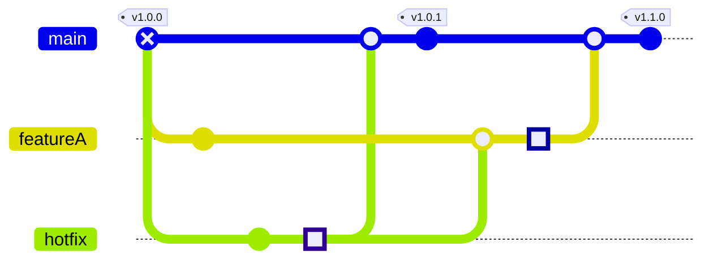

+++
title = "Mermaid.js の Git コミット図が正式版になった"
date =  "2022-04-10T10:03:14+09:00"
description = "個人的には縦向きに対応して欲しい。"
image = "/images/attention/kitten.jpg"
tags = [ "mermaid", "git" ]
pageType = "text"

[scripts]
  mathjax = false
  mermaidjs = true
+++

先日 [mermaid] 9.0.0 がリリースされたが `gitGraph` がアルファ版から昇格したようだ。


Moving the gitGraph from experimental alpha status to a fully supported diagram type which handles theming and directives. The grammar has changed slightly from the alpha version, and no longer supports reset operations and some internal fast-forwarding has been removed for simplicity. Some few GitGraphs based on the alpha version might break with the update. **This is the reason for the major version number update**.


詳しい使い方は

- [Gitgraph Diagrams](http://mermaid-js.github.io/mermaid/#/gitgraph)

を参照してもらうとして，たとえば





などと書けば

と展開される[^mm1]。
何故かマージに対してタグが打てないが，まぁいいか。
Git 操作手順に近い感じで記述していけばグラフ化してくれるのがいい感じだよね。

個人的には縦向きに対応して欲しいところである。
でも，まずはめでたい！

[^mm1]: ちなみに `mainBranchName` の既定値は `main` なので，本来は `'mainBranchName':'main'` と明示しなくても大丈夫。

[mermaid]: http://mermaid-js.github.io/mermaid/ "mermaid - Markdownish syntax for generating flowcharts, sequence diagrams, class diagrams, gantt charts and git graphs."
<!-- eof -->
