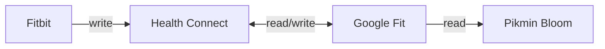

+++
title = "Pikmin Bloom と FitBit との連携"
date =  "2022-12-31T21:35:13+09:00"
description = "Health Connect を経由して Google Fit と Fitbit を連携させることは可能らしい。"
image = "/images/attention/kitten.jpg"
tags = [ "game", "disease", "tools" ]
pageType = "text"

[scripts]
  mathjax = false
  mermaidjs = true
+++

実は夏頃にケータイを交換するというハプニングがあって（落っことしたら当たりどころが悪くてガラス面ががが）アプリを入れ直す羽目になったのだが，スマホゲームは諦めてたのね。
どうせやる暇ないし（すっぱい葡萄）

最近[心臓リハビリ]( "ハライタだと思った？ 残念！ 心筋梗塞でした")の一環でウォーキングという名の散歩をしてるんだけど，ただ歩いててもつまらないし [Pikmin Bloom] を再開するかと再インストールした。
うろ覚えのアカウントで入ったら前のデータが残ってるじゃん。
ありがたや。
ゼロからやり直さなくてよかったよ。

[Pikmin Bloom] は [Google Fit](https://www.google.com/intl/ja_jp/fit/) と連携することでバックグラウンドで歩数をカウントできるんだけど，[心拍数をモニタするために FitBit を導入]()した身としては，これと連携してほしいわけよ。

で，調べたら [Pikmin Bloom] と [Fitbit] を直接連携することは出来ないけど [Health Connect] を経由して [Google Fit] と [Fitbit] を連携させることは可能らしい。

- [Health Connect (Beta) - Apps on Google Play](https://play.google.com/store/apps/details?id=com.google.android.apps.healthdata)
- [Google、ヘルスケアとフィットネスデータを一元管理するアプリ「ヘルスコネクト」（β）公開 - ITmedia Mobile](https://www.itmedia.co.jp/mobile/articles/2211/15/news137.html)

これを使うことで以下のように構成できる。

[Fitbit アプリ][Fitbit App]は [Health Connect] に対して書き込み権限しかない。
[Fitbit] を使う限り，このデータを主とするしかないのだ。
一方 [Google Fit アプリ][Google Fit App]のほうは [Health Connect] に対して読み書きともにフルアクセスできる。
まぁ，今回は [Fitbit] が主なので [Google Fit アプリ][Google Fit App]からの書き込み権限は要らないだろう。
[Pikmin Bloom] が [Health Connect] に直接アクセスできれば [Google Fit] 自体が要らないんだけどねぇ。

ちなみに移動履歴に関しては [Pikmin Bloom] 自身が計測しているようで [Fitbit] だけ装着して移動しても [Pikmin Bloom] 側はその場で足踏みしているような状態になる。
花をばら撒きたいならスマホも持ち歩きましょうね，ということで。

先に述べたように心拍数をモニタしながら散歩をするのだが，平坦な道を歩くときはかなり早歩きでも大丈夫ぽいのだが，坂道を登り始めるとゆっくり歩いても心拍数が跳ね上がることがある。
この辺の負荷のかかり方を調整しながらペース配分をしないといけないようだ。

...やっぱローラー台ほしいなぁ。

## ブックマーク

- [FitbitのデータをGoogle Fitへアプリを使って連携させる方法（Android）](https://habiyura.com/archives/50807358.html)
- [ピクミンブルームの歩数カウンターはMiFitの歩数計と連動している - 『７回目の出直し🌻』](https://kanaxx.hatenablog.jp/entry/mi-fit-to-pikmin-bloom)

- [ピクミンとメタなあれ]()

[Niantic]: https://nianticlabs.com/ "Niantic, Inc."
[Pikmin Bloom]: https://www.pikminbloom.com/ "Pikmin Bloom 「ピクミン ブルーム」 - ピクミンとおでかけ"
[Google Fit]: https://www.google.com/intl/ja_jp/fit/
[Google Fit App]: https://play.google.com/store/apps/details?id=com.google.android.apps.fitness "Google Fit: Activity Tracking - Apps on Google Play"
[Fitbit]: https://www.fitbit.com/
[Fitbit App]: https://play.google.com/store/apps/details?id=com.fitbit.FitbitMobile "Fitbit - Apps on Google Play"
[Health Connect]: https://developer.android.com/health-connect "Health Connect  |  Android Developers"

## 参考

{} <!-- 愛のうた ～ ピクミンCMソング -->
