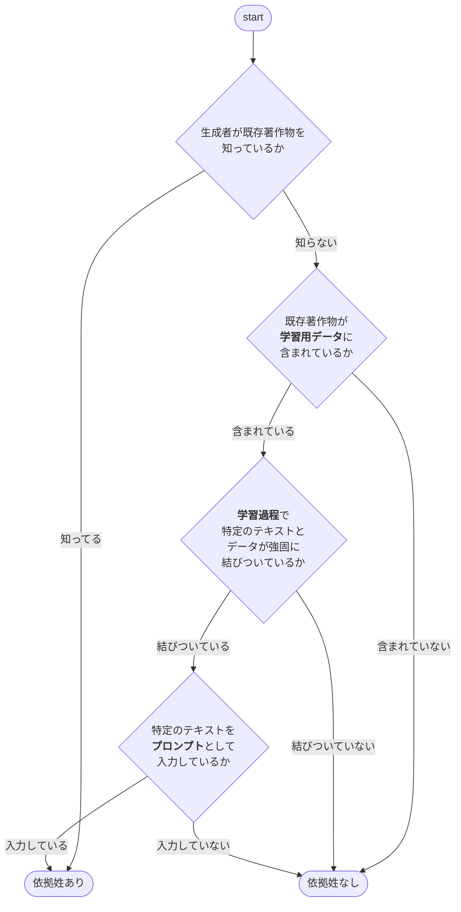

+++
title = "Generative AI は Copyright-Safe か？"
date =  "2023-06-19T21:30:47+09:00"
description = "文化庁の資料みても分からん"
image = "/images/attention/kitten.jpg"
tags = [ "code", "law", "intellectual-property", "copyright", "artificial-intelligence" ]
pageType = "text"

[scripts]
  mathjax = false
  mermaidjs = true
+++

おー，久しぶりにこのセクションに書くな。
ここ最近いろいろあって，ブログ記事を書く気分じゃなかった。
まぁ，ここのポリシーは「書きたくないときには書かない」だから（笑） 徐々に復帰... できるといいねぇ。

## Generative AI は Copyright-Safe か？

起点はこの記事。

- [生成AI、画像の特徴が似ていれば「著作権侵害」にあたる？ 文化庁の最新見解を読み解く - 弁護士ドットコム](https://www.bengo4.com/c_23/n_16133/)

この記事で紹介されている文化庁の資料ってのがこれらしい。



いやいや。
これじゃ分からんが！ しょうがない。
最初に挙げた記事を参考に見ていこう。


著作権侵害の要件は大きく分けると「既存著作物との同一性・類似性」と「既存著作物への依拠性」の2つです。

前者の「既存著作物との同一性・類似性」について、AIは関係ありません。これまでの膨大な判例を元に、判断基準がほぼ確立しています。

**たとえ「作風・画風」が類似していたとしても、「同一性・類似性」があることにはなりません。これは文化庁の資料に記載されているとおりです。**


となると，問題は「既存著作物への依拠性」というわけだ。
これについて件の記事では以下のように示している。


（1）生成者が既存著作物を知っているか → 知っていれば依拠性あり、知らなければ（2）に

（2）既存著作物が学習用データに含まれているか →含まれていなければ依拠性なし、含まれていれば（3）へ

（3）当該学習用データ（画像）を学習過程で用いる際に、特定のテキストと、当該データ（画像）の表現上の本質的特徴が強固に結びついているか →結びついていなければ依拠性なし、結びついていれば（4）へ

（4） 利用段階で（3）における「特定のテキスト」をプロンプトとして入力しているか 　→入力していれば依拠性あり、入力していなければ依拠性なし（独自創作）


これならだいぶ分かりやすい。
フローチャートっぽく書くとこんな感じか。

んー。
イマイチ。
まぁいいや。
これを見ると判断のポイントが3つあることが分かる。
すなわち

1. 学習用データ
2. 学習過程
3. プロンプト

である。

つまり生成物を公表する際，著作権侵害にあたるかどうかを判断するために上の3つの情報開示を要求される可能性があるということだ。
そして，この要求に応えられないサービスは copyright-safe とは言えないのではないかと思う。
また，利用者は生成時のプロンプトが（おそらくサービスプロバイダ経由で）開示される可能性を考慮する必要がある。

さらに記事では「AI開発・学習段階でも「著作権侵害」の可能性あり？」として


AIの文脈に即して少し抽象化すると「学習対象著作物の『表現上の本質的な特徴』を感じ取れるような著作物の作成を目的として、学習対象著作物から必要な情報を抽出する」行為と言い換えることができます。

要は「学習行為」（情報解析行為）であっても、当該学習行為の結果生成されたAIモデルからの出力が著作権侵害に該当する可能性がある場合には、享受利用に該当するという解釈なのでしょう。


と解説し，さらに


**この考え方は、「AI開発・学習段階」と「生成・利用段階」を分けて考えるべきとしつつ、結局「生成・利用段階」での著作権侵害の可能性を理由に、前段階である学習行為（情報解析行為）を制限しようとする考え方なので、条文解釈として個人的には疑問があります。**

「学習行為」というある著作物の利用行為の「享受」「非享受」の判断において、まだ現実に生じていない著作権侵害の可能性を考慮することができるのかということです。「どのような場合にAI学習を制限すべきか」という重要論点は、これからさらに議論が進んでいくのではないでしょうか。


と意見を述べている。
実は日本は言われているほど「AI 天国」ではないということかもしれない。

## 【おまけ】 享有と享受

話が横滑りしてスマン。

上で出てきた「享受」という法律用語は[著作権法]の「著作権の制限」に出てくる。
たとえば第三十条の四は「著作物に表現された思想又は感情の享受を目的としない利用」について書かれている。


**第三十条の四**　著作物は、次に掲げる場合その他の当該著作物に表現された思想又は感情を自ら享受し又は他人に享受させることを目的としない場合には、その必要と認められる限度において、いずれの方法によるかを問わず、利用することができる。ただし、当該著作物の種類及び用途並びに当該利用の態様に照らし著作権者の利益を不当に害することとなる場合は、この限りでない。


これで思い出したのが山田奨治さんの『[著作権は文化を発展させるのか: 人権と文化コモンズ][人権と文化コモンズ]』だった。
たとえば[著作権法]第十七条「著作者の権利」には


**第十七条**　著作者は、次条第一項、第十九条第一項及び第二十条第一項に規定する権利（以下「著作者人格権」という。）並びに第二十一条から第二十八条までに規定する権利（以下「著作権」という。）を享有する。


とある。
享有とか享受とかって難しい言葉がさらっと書いてあるよね。
しかも『[人権と文化コモンズ]』には


実は民法でいう「私権の享有」は、辞書的な意味とはやや異なり権利能力（権利の主体となるができる法律上の資格、または地位）のことを言う。そして、「私権の享有は出生に始まる」は、「権利を持つのは、生まれた時からである」の意味になる（大村 2007：24）。「享有」はたんに「持つ」ことであって、「生まれながら」は含まない。（p.32）


とか書いてあって「うへぇ」となった。
『[人権と文化コモンズ]』には享有や専有といった用語についてかなり深く考察しているので，読んでみることをお勧めする。

享受は享有と対になる言葉っぽいが，英語ではどちらも enjoy が法律用語として充てられているそうな（これも『[人権と文化コモンズ]』に書いてあった）。
前節の記事に出てくる「享受」を脳内で enjoy と読み直せばもう少し分かりやすくなるかもしれない（笑）

法律（用語）は難しいぜ。

## ブックマーク

- [ウェブをますます暗い森にし、人間の能力を増強する新しい仲間としての生成AI – WirelessWire News](https://wirelesswire.jp/2023/06/84905/)
- [AI は「創作者様」を引きずり下ろすか — 『人権と文化コモンズ』を流し読む]()

[著作権法]: https://elaws.e-gov.go.jp/document?lawid=345AC0000000048 "著作権法 | e-Gov法令検索"
[人権と文化コモンズ]: https://www.amazon.co.jp/dp/B099RTG3J7?tag=baldandersinf-22&linkCode=ogi&th=1&psc=1 "著作権は文化を発展させるのか: 人権と文化コモンズ"

## 参考文献

{} <!-- 著作権は文化を発展させるのか: 人権と文化コモンズ -->
{} <!-- 日経サイエンス2023年5月号（特集：対話するAI ChatGPT） -->
